## Lab1 Booting a PC

This lab is divided into three parts. In the first part, we get familiar with assembly codes and the PC booting procedure. In the second part, we take a loot at boot loader. In the last part, we get to know the JOS kernel we are going to write.


#### Part1	PC Bootstrap

Get familiar with assembly codes.


#### Part2	The Boot Loader

**Exercise 1.**  *Familiarize yourself with the assembly language materials available on [the 6.828 reference page](https://pdos.csail.mit.edu/6.828/2018/reference.html). You don't have to read them now, but you'll almost certainly want to refer to some of this material when reading and writing x86 assembly.* 

*We do recommend reading the section "The Syntax" in [Brennan's Guide to Inline Assembly](http://www.delorie.com/djgpp/doc/brennan/brennan_att_inline_djgpp.html). It gives a good (and quite brief) description of the AT&T assembly syntax we'll be using with the GNU assembler in JOS.*

A: Here I read the inline assembly page, which is helpful:D


**Exercise 2.** *Use GDB's si (Step Instruction) command to trace into the ROM BIOS for a few more instructions, and try to guess what it might be doing. You might want to look at [Phil Storrs I/O Ports Description](http://web.archive.org/web/20040404164813/members.iweb.net.au/~pstorr/pcbook/book2/book2.htm), as well as other materials on the [6.828 reference materials page](https://pdos.csail.mit.edu/6.828/2018/reference.html). No need to figure out all the details - just the general idea of what the BIOS is doing first.*


A: In BIOS, the BIOS initializes hardwares and set up interrupt descriptor table.


**Exercise 3.** *Take a look at the [lab tools guide](https://pdos.csail.mit.edu/6.828/2018/labguide.html), especially the section on GDB commands. Even if you're familiar with GDB, this includes some esoteric GDB commands that are useful for OS work.*

*Set a breakpoint at address 0x7c00, which is where the boot sector will be loaded. Continue execution until that breakpoint. Trace through the code in `boot/boot.S`, using the source code and the disassembly file `obj/boot/boot.asm` to keep track of where you are. Also use the `x/i` command in GDB to disassemble sequences of instructions in the boot loader, and compare the original boot loader source code with both the disassembly in `obj/boot/boot.asm` and GDB.*

*Trace into `bootmain()` in `boot/main.c`, and then into `readsect()`. Identify the exact assembly instructions that correspond to each of the statements in `readsect()`. Trace through the rest of `readsect()` and back out into `bootmain()`, and identify the begin and end of the `for` loop that reads the remaining sectors of the kernel from the disk. Find out what code will run when the loop is finished, set a breakpoint there, and continue to that breakpoint. Then step through the remainder of the boot loader.*


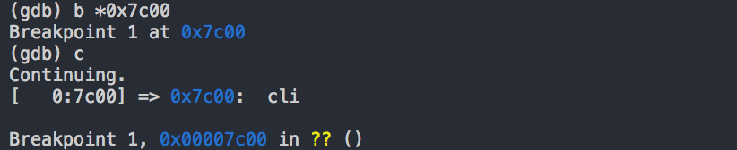


A: Set up the breakpoint where the boot sector is going to be loaded and continue executing.

Compare boot.S and boot.asm.We can see the physical addresses in boot.asm

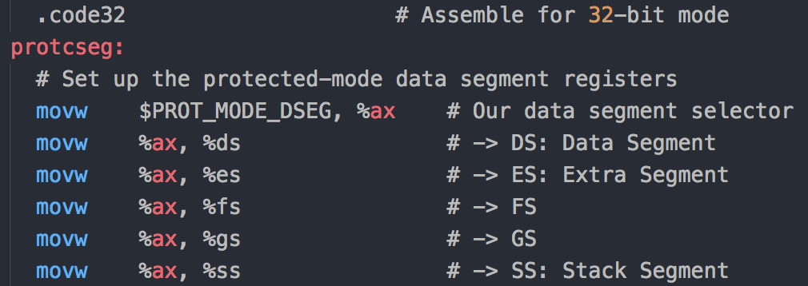

##### 																				(boot.S)

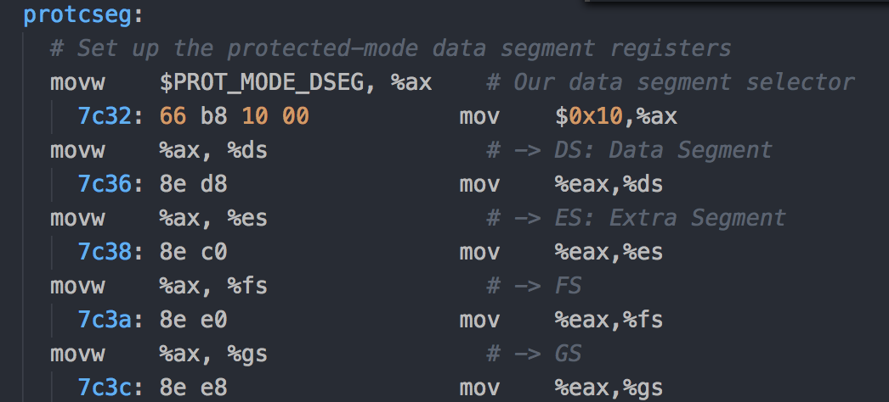

##### 																				(boot.asm)

Following is the assembly code of readsect function in "boot/main.c"

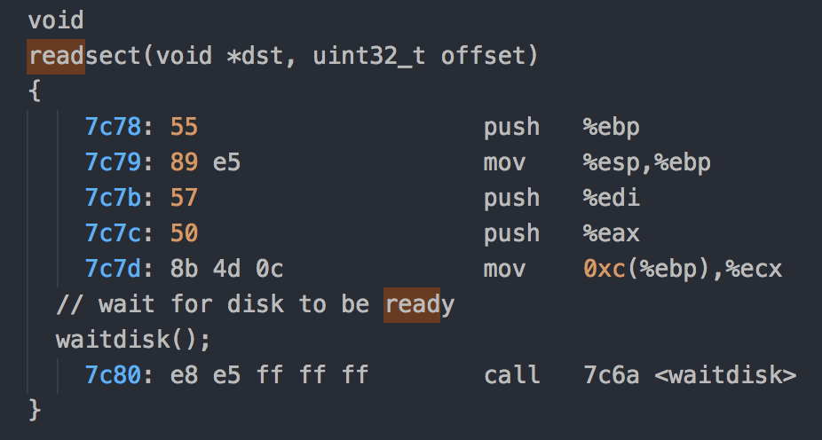


Following is the whole loop.

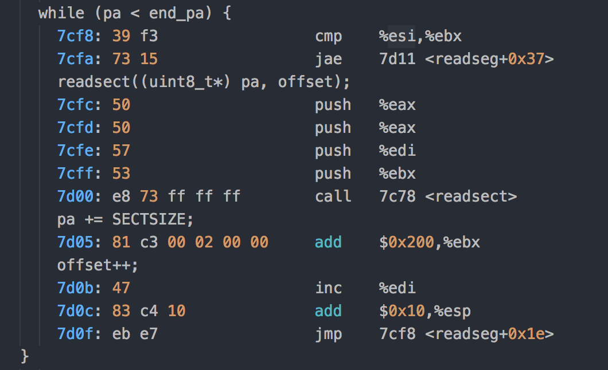


When the loop finishes, it will continue execute the following commands.

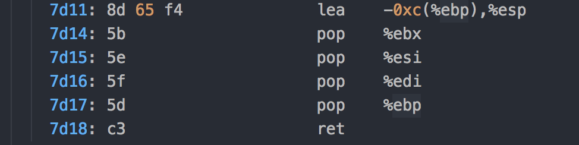


#### Questions

Q1: At what point does the processor start executing 32-bit code? What exactly causes the switch from 16- to 32-bit mode?

  


A: After setting the CR0 register to enable 32 bit mode and giving the command to load the gdt table, we still need to change the segment register's value in order to actually start loading, which is accomplished with `  	ljmp    $PROT_MODE_CSEG, $protcseg`

After that, all the codes we run are 32 bits.


Q2: What is the *last* instruction of the boot loader executed, and what is the *first* instruction of the kernel it just loaded?

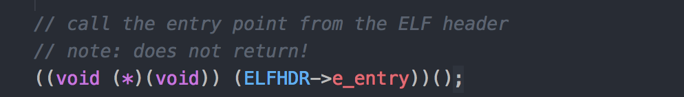

A: The last instruction the boot loader executed is to call the kernel's entry point	(boot/main.c).


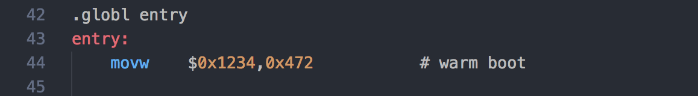

The first instruction the kernel executed is in kern/entry.S


Q3: 	*Where* is the first instruction of the kernel?

A: The first instruction of the kernel is located in "kern/entry.S"

​	Its physical address is 0x10000c.


Q4:	How does the boot loader decide how many sectors it must read in order to fetch the entire kernel from disk? Where does it find this information?

A:	The boot loader first read the second sector from disk(the first one is the boot loader) into memory, the second 4096 bytes(512 * 8), which contains the elf header. Based on the elf header, we can know the info we need to copy the entire kernel into memory.


#### Loading the kernel

**Exercise 4.** 	*Read about programming with pointers in C. The best reference for the C language is The C Programming Language by Brian Kernighan and Dennis Ritchie (known as 'K&R')*. *We recommend that students purchase this book (here is an [Amazon Link](http://www.amazon.com/C-Programming-Language-2nd/dp/0131103628/sr=8-1/qid=1157812738/ref=pd_bbs_1/104-1502762-1803102?ie=UTF8&s=books)) or find one of [MIT's 7 copies](http://library.mit.edu/F/AI9Y4SJ2L5ELEE2TAQUAAR44XV5RTTQHE47P9MKP5GQDLR9A8X-10422?func=item-global&doc_library=MIT01&doc_number=000355242&year=&volume=&sub_library=).*

*Read 5.1 (Pointers and Addresses) through 5.5 (Character Pointers and Functions) in K&R. Then download the code for [pointers.c](https://pdos.csail.mit.edu/6.828/2018/labs/lab1/pointers.c), run it, and make sure you understand where all of the printed values come from. In particular, make sure you understand where the pointer addresses in printed lines 1 and 6 come from, how all the values in printed lines 2 through 4 get there, and why the values printed in line 5 are seemingly corrupted.*

*There are other references on pointers in C (e.g., [A tutorial by Ted Jensen](https://pdos.csail.mit.edu/6.828/2018/readings/pointers.pdf) that cites K&R heavily), though not as strongly recommended.*

*Warning: Unless you are already thoroughly versed in C, do not skip or even skim this reading exercise. If you do not really understand pointers in C, you will suffer untold pain and misery in subsequent labs, and then eventually come to understand them the hard way. Trust us; you don't want to find out what "the hard way" is.*

A： Since I have already known pointers in c, I didn't spend a lot of time in this part.


**Exercise 5.** *Trace through the first few instructions of the boot loader again and identify the first instruction that would "break" or otherwise do the wrong thing if you were to get the boot loader's link address wrong. Then change the link address in `boot/Makefrag` to something wrong, run make clean, recompile the lab with make, and trace into the boot loader again to see what happens. Don't forget to change the link address back and make clean again afterward!*

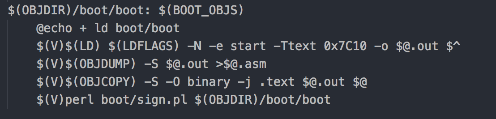

A : Change the boot loader's link address to 0x7C10, which is different from its load address.

Then I `make clean` and `make`, then run `make qemu-nox`, it broke.

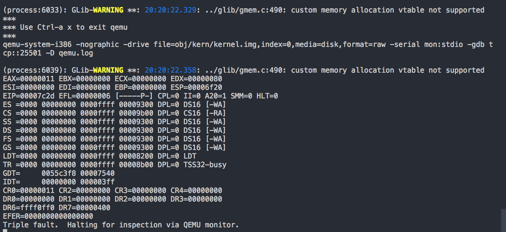


So i decided to let use gdb to debug it.

I let it run without setting points and it seems to break down here.

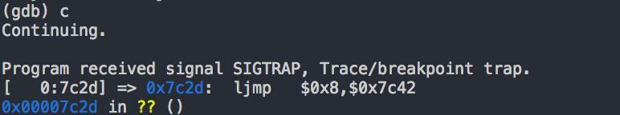

I guess the reason for this is that the memory that `ljmp` want to jump to may causes the trouble. Since the link address we give to the linker mismatches with the load address, the link address calculated by the linker may be totally wrong, which may lead to the problem.


**Exercise 6.** *We can examine memory using GDB's x command. The [GDB manual](https://sourceware.org/gdb/current/onlinedocs/gdb/Memory.html) has full details, but for now, it is enough to know that the command x/Nx ADDR prints N words of memory at ADDR. (Note that both '`x`'s in the command are lowercase.) Warning:The size of a word is not a universal standard. In GNU assembly, a word is two bytes (the 'w' in xorw, which stands for word, means 2 bytes).*

*Reset the machine (exit QEMU/GDB and start them again). Examine the 8 words of memory at 0x00100000 at the point the BIOS enters the boot loader, and then again at the point the boot loader enters the kernel. Why are they different? What is there at the second breakpoint? (You do not really need to use QEMU to answer this question. Just think.)*

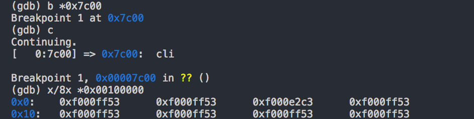

8 words of memory when the BIOS enters the boot loader.

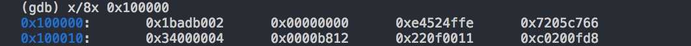

8 words of memory when the boot loader loads the kernel.

The different is that when the boot loader enters the kernel, we've already loaded the kernel to 0x00100000.


#### Part3 The Kernel

**Exercise 7.** *Use QEMU and GDB to trace into the JOS kernel and stop at the `movl %eax, %cr0`. Examine memory at 0x00100000 and at 0xf0100000. Now, single step over that instruction using the stepi GDB command. Again, examine memory at 0x00100000 and at 0xf0100000. Make sure you understand what just happened.*

*What is the first instruction after the new mapping is established that would fail to work properly if the mapping weren't in place? Comment out the `movl %eax, %cr0` in `kern/entry.S`, trace into it, and see if you were right.*


A: Add the breakpoint at `	movl	%cr0, %ea`(f0100025). We can see that the contents in "0x00100000" and "0xf0100000" are different.

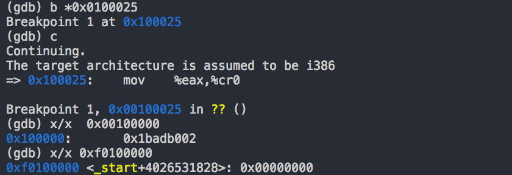


Use `stepi` to see the next machine instruction it executes. Now we can see that the contents in "0x00100000" and "0xf0100000" are magically the same! 

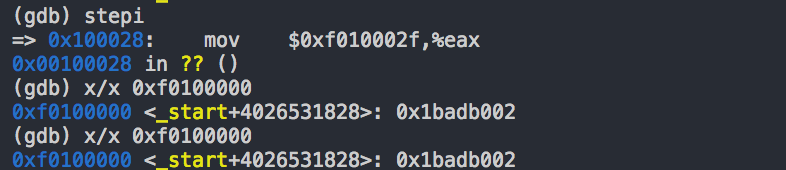


Here comes the reason.  In line 27, we load the physical address of the entry_pgdir into %eax, and then load it into cr3, which is the page directory register. After line 36, we enable paging by setting %cr0 register. Then the paging starts working and map the physical and virtual address and make sure that the contents in these two address are the same.

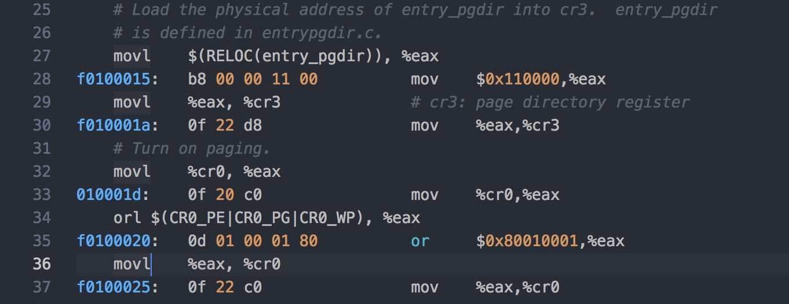


Then we comment `movl	%eax, %cr0`.Run `make clean` and `make`.

Let's see where it will break down.

When it executes until `jmp *%eax`, it breaks.

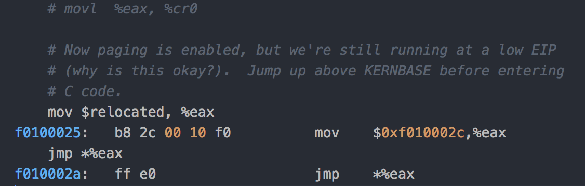

We can see that the value of %eax is "0xf010002c". Since we comment `movl %eax, %cr0`, we don't enable paging. And the address "0xf010002c" is not valid. So it breaks.

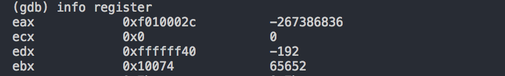


#### Formatted Printing to the Console

**Exercise 8.** *We have omitted a small fragment of code - the code necessary to print octal numbers using patterns of the form "%o". Find and fill in this code fragment.*


##### Questions:

Q1: *Explain the interface between `printf.c` and `console.c`. Specifically, what function does `console.c` export? How is this function used by `printf.c`?*

The interface between `printf.c` and `console.c` is function `cputchar`, which is exported from `console.c` and used by `printf.c`. `printf.c` uses `cputchar` to print the character.


Q2:  *Explain the following from console.c :*

```
1      if (crt_pos >= CRT_SIZE) {
2              int i;
3              memmove(crt_buf, crt_buf + CRT_COLS, (CRT_SIZE - CRT_COLS) * 					sizeof(uint16_t));
4              for (i = CRT_SIZE - CRT_COLS; i < CRT_SIZE; i++)
5                      crt_buf[i] = 0x0700 | ' ';
6              crt_pos -= CRT_COLS;
7      }
```

`CRT_SIZE` is the total character that can be displayed on a single page. 


After we fill a whole page, we should scroll down a line to allow new characters to be displayed.

And we initialize the last line  to be spaces.


Q3: *For the following questions you might wish to consult the notes for Lecture 2. These notes cover GCC's calling convention on the x86.*

*Trace the execution of the following code step-by-step:*

```
int x = 1, y = 3, z = 4;
cprintf("x %d, y %x, z %d\n", x, y, z);
```

- *In the call to `cprintf()`, to what does `fmt` point? To what does `ap` point?*
- *List (in order of execution) each call to `cons_putc`, `va_arg`, and `vcprintf`. For `cons_putc`, list its argument as well. For `va_arg`, list what `ap` points to before and after the call. For `vcprintf` list the values of its two arguments.*


A: `fmt` points to `"x %d, y %x, z %d\n"` , ap is of type `va_list` and carrys the function arguments.

​	 Call in order:

vcprintf ( fmt=0xf01017f7 "x %d, y %x, z %d\n",  ap=0xf010ffd4 "\001")

cons_putc (c=864)

cons_putc (c=980)

cons_putc (c=-1)

cons_putc (c=980)

...


Q4:	*Run the following code.*

```
    unsigned int i = 0x00646c72;
    cprintf("H%x Wo%s", 57616, &i);
```

*What is the output? Explain how this output is arrived at in the step-by-step manner of the previous exercise.*

*Here's an ASCII table that maps bytes to characters.*

*The output depends on that fact that the x86 is little-endian. If the x86 were instead big-endian what would you set `i` to in order to yield the same output? Would you need to change `57616` to a different value?*

[Here's a description of little- and big-endian](http://www.webopedia.com/TERM/b/big_endian.html) and [a more whimsical description](http://www.networksorcery.com/enp/ien/ien137.txt).


A: 

We can see the result of the following code is

```
H0xe110 World
```


 Let us dive a little bit deeper.

First `printfmt` meets normal characters like "H", it just prints "H" out normally.

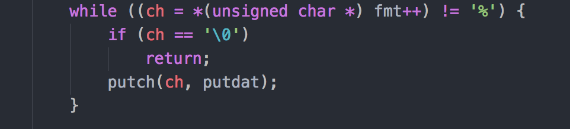


However when it meets "%x",  it first prints out "0x". Then it treats the following number as unsigned hexadecimal using function `getuint`, finally it prints the number out using function `printnum`.

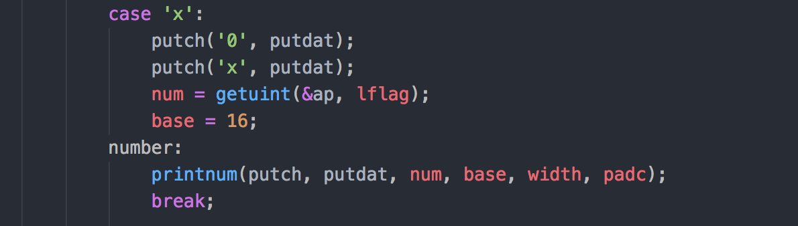

Here we read 57616 and print num in hexadecimal. `57616` is `e110` in hexadecimal.

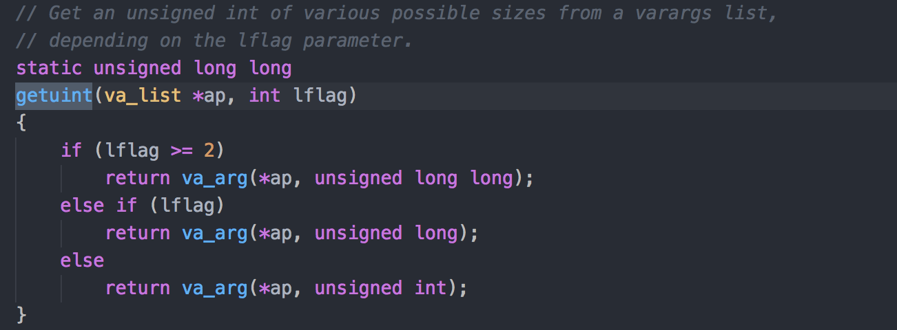


Then we read "Wo" and print it out normally. When we meet "%s", we print all characters in 0x00646c72.

Since x86 is little endian, so the first character should be `0x72`, second `0x6c`, third `0x64`.

According to the ASCII table, we can know that the first character is ` r`, the second is` l`, and the last is `d`.


Q5: *In the following code, what is going to be printed after  'y=' ? (note: the answer is not a specific value.) Why does this happen?*

```
    cprintf("x=%d y=%d", 3);
```

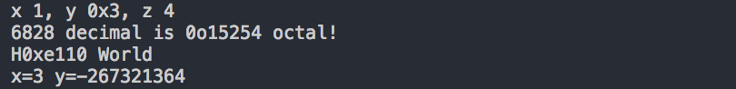

Since we don't give enough parameters to cprintf, when we try to get the second number, va_arg gets the next number although it has been to the end of va_list. It actually depends on the contents in the next  memory block, so it is not a specfic value.


Q6: *Let's say that GCC changed its calling convention so that it pushed arguments on the stack in declaration order, so that the last argument is pushed last. How would you have to change `cprintf` or its interface so that it would still be possible to pass it a variable number of arguments?*

A: If gcc pushes arguments onto stack, the order of the parameters are reversed. If we still want to pass it a variable of arguments, we can send the parameters of `crpintf` to another function so the parameters can be reversed again.

```
int
cprintf(const char *fmt, ...)
{
	int reverse(const char *fmt, ...){
		va_list ap;
		int cnt;
		
		va_start(ap, fmt);
		cnt = vcprintf(fmt, ap);
		return cnt;
	}
	return reverse(fmt, ...);
}
```


##### *Challenge* 

*Enhance the console to allow text to be printed in different colors. The traditional way to do this is to make it interpret [ANSI escape sequences](http://rrbrandt.dee.ufcg.edu.br/en/docs/ansi/) embedded in the text strings printed to the console, but you may use any mechanism you like. There is plenty of information on [the 6.828 reference page](https://pdos.csail.mit.edu/6.828/2018/reference.html) and elsewhere on the web on programming the VGA display hardware. If you're feeling really adventurous, you could try switching the VGA hardware into a graphics mode and making the console draw text onto the graphical frame buffer.*

```c
// if no attribute given, then use black on white
if(~(c & ~(0xff))){
	c |= 0x700;
}
```


A: According to the comment, we succesffuly figure out that the lower bits of c should be the control bit of vga display color.

​	Then I want to set a `%r`  parameter in `fmt` to set the color.

​	Here are the changes I make.

 1. In `kern/console.h`, add text_color variable.

    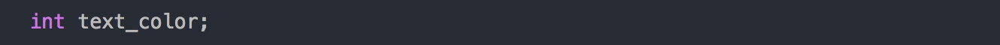

2. Modify the code in `lib/printfmt.c`

   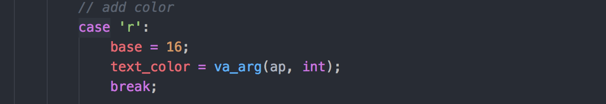

3. Modify `kern/console.c`

   

4. Create test case in `kern/init.c`

   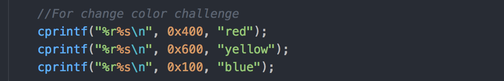

   

5. Finally the result

   


#### The stack

**Exercise 9.** *Determine where the kernel initializes its stack, and exactly where in memory its stack is located. How does the kernel reserve space for its stack? And at which "end" of this reserved area is the stack pointer initialized to point to?*

A :	At line 77 in `entry.S`, stack pointer is set, which means the initialization of the stack.


These codes in `entry.S` is the detailed description of kernel stack.

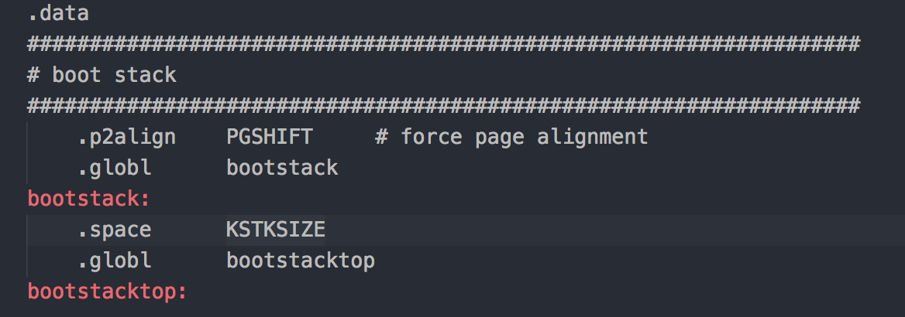

KSTSIZE is defined in `ibc/memlayout.h`, which defines it to be `8 * PGSIZE`. Then we find in `mmu.h` that `PGSIZE` is `4096 bytes`. So the stack should be located from `0xf0110000` to `0xf0108000`.

The kernel resercves the memory space for the stack by defining `%esp` and `.space`.  The highest addresss of the stack is pointed to by the stack pointer.


**Exercise 10.** *To become familiar with the C calling conventions on the x86, find the address of the `test_backtrace` function in `obj/kern/kernel.asm`, set a breakpoint there, and examine what happens each time it gets called after the kernel starts. How many 32-bit words does each recursive nesting level of `test_backtrace` push on the stack, and what are those words?*

*Note that, for this exercise to work properly, you should be using the patched version of QEMU available on the [tools](https://pdos.csail.mit.edu/6.828/2018/tools.html) page or on Athena. Otherwise, you'll have to manually translate all breakpoint and memory addresses to linear addresses.*

A :  From reading `kernel.asm`, we find the following address. The function `test_backtrace`' s virtual address is `0xf100040`. 

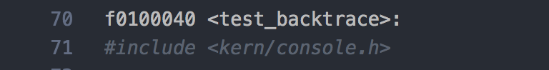

​	 `test_backtrace` emulates the procedure of calling a function in c.

​	 It loads the paramters and saves the return address of the caller.

1. Test_backtrace(x=5)

   push %ebp	0xf010fff8

   push %ebx 	0x10074

2. test_backtrace (x=4)

   push %ebp	0xf010ffc8

   push %ebx	0x5

3. test_backtrace (x=3)

   push %ebp	0xf010ffa8

   push %ebx	0x4

4. test_backtrace (x=2)

   push %ebp	0xf010ff88 

   push %ebx	0x3

5. test_backtrace (x=1)

   push %ebp	0xf010ff68 

   push %ebx	0x2

6. test_backtrace (x=0)

   push  %ebp	0xf010ff48 

   push %ebx	0x1


From there, we can see that each stack of the function is 32 bytes.

And %ebx stores the parameter passed to the function.


##### Question:

*1. The return instruction pointer typically points to the instruction after the `call` instruction (why?).*

A : After the execution of the called funcition, we can directly executes the next instruction based on the return instruction pointer.


2. *Why can't the backtrace code detect how many arguments there actually are? How could this limitation be fixed?*

A: There is no counter in the assembly code. To solve this limitaion, we can set up a register for counting the number of parameters.


**Exercise 11.** *Implement the backtrace function as specified above. Use the same format as in the example, since otherwise the grading script will be confused. When you think you have it working right, run make grade to see if its output conforms to what our grading script expects, and fix it if it doesn't. After you have handed in your Lab 1 code, you are welcome to change the output format of the backtrace function any way you like.*

*If you use `read_ebp()`, note that GCC may generate "optimized" code that calls `read_ebp()` before `mon_backtrace()`'s function prologue, which results in an incomplete stack trace (the stack frame of the most recent function call is missing). While we have tried to disable optimizations that cause this reordering, you may want to examine the assembly of `mon_backtrace()` and make sure the call to `read_ebp()` is happening after the function prologue.*


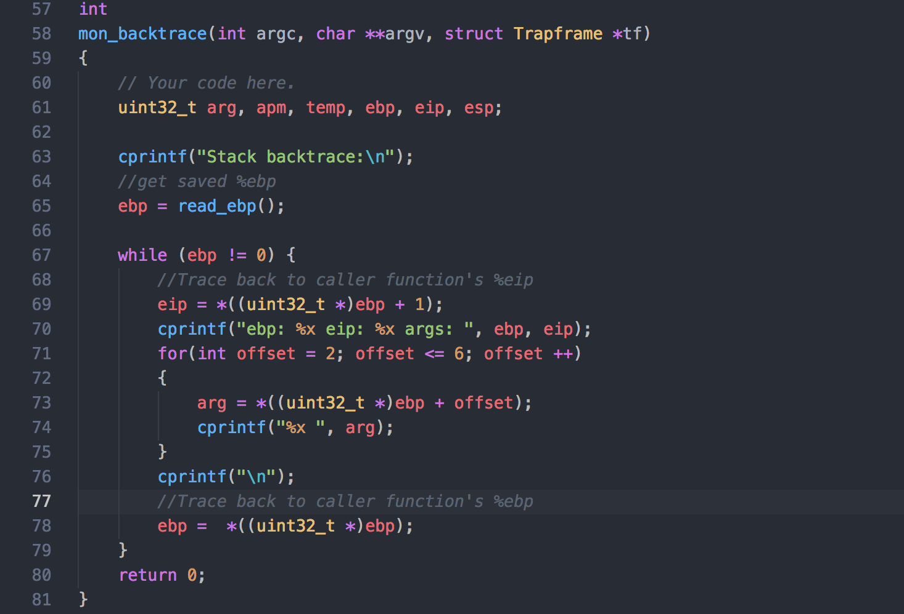

Described in the picture above, I give my solution to the exercise.

It is about the gcc calling convention.

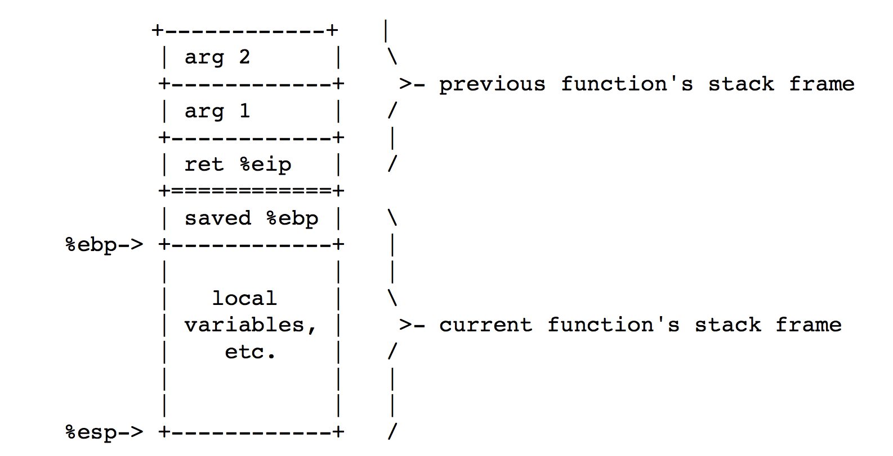

When the caller wants to call another function, it first pushes the arguments and instruction pointer onto the stack. In the callee function, we saves the `%ebp` register value onto stack. The value of callee's 

`%esp` stores the address of the caller's `%ebp`. 

```assembly
push %ebp
mov %esp, %ebp
push %ebx
```

After executing the following codese, the callee's `%ebp` register now stores the address of the caller's `%ebp`. The critical point of the exercise is to understand this point. What's more,  we can see from the illustration that the caller's `4(%%ebp)`  and the arguments can also be found with specfic offset plus `%ebp`.


**Exercise 12.** Modify your stack backtrace function to display, for each `eip`, the function name, source file name, and line number corresponding to that `eip`.

In `debuginfo_eip`, where do `__STAB_*` come from? This question has a long answer; to help you to discover the answer, here are some things you might want to do:

- look in the file `kern/kernel.ld` for `__STAB_*`
- run `objdump -h obj/kern/kernel`
- run `objdump -G obj/kern/kernel`
- run `gcc -pipe -nostdinc -O2 -fno-builtin -I. -MD -Wall -Wno-format -DJOS_KERNEL -gstabs -c -S `kern/init.c, and look at init.s.
- see if the bootloader loads the symbol table in memory as part of loading the kernel binary

Complete the implementation of `debuginfo_eip` by inserting the call to `stab_binsearch` to find the line number for an address.

Add a `backtrace` command to the kernel monitor, and extend your implementation of `mon_backtrace` to call `debuginfo_eip` and print a line for each stack frame of the form:

```
K> backtrace
Stack backtrace:
  ebp f010ff78  eip f01008ae  args 00000001 f010ff8c 00000000 f0110580 00000000
         kern/monitor.c:143: monitor+106
  ebp f010ffd8  eip f0100193  args 00000000 00001aac 00000660 00000000 00000000
         kern/init.c:49: i386_init+59
  ebp f010fff8  eip f010003d  args 00000000 00000000 0000ffff 10cf9a00 0000ffff
         kern/entry.S:70: <unknown>+0
K> 
```

Each line gives the file name and line within that file of the stack frame's `eip`, followed by the name of the function and the offset of the `eip` from the first instruction of the function (e.g., `monitor+106` means the return `eip` is 106 bytes past the beginning of `monitor`).

Be sure to print the file and function names on a separate line, to avoid confusing the grading script.

Tip: printf format strings provide an easy, albeit obscure, way to print non-null-terminated strings like those in STABS tables. `printf("%.*s", length, string)` prints at most `length` characters of `string`. Take a look at the printf man page to find out why this works.

You may find that some functions are missing from the backtrace. For example, you will probably see a call to `monitor()` but not to `runcmd()`. This is because the compiler in-lines some function calls. Other optimizations may cause you to see unexpected line numbers. If you get rid of the `-O2` from `GNUMakefile`, the backtraces may make more sense (but your kernel will run more slowly).


1. look in the file `kern/kernel.ld` for `__STAB_*`

   There are many `__STAB_*` in kernel.ld. The following pic just shows a small portion of it.

   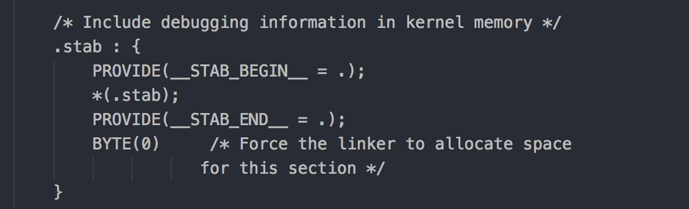

2. run `objdump -h obj/kern/kernel`

   Display the sections in kernel elf.

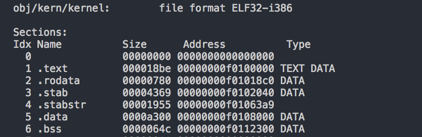

2. Run `objdump -G obj/kern/kernel` , we print any stabs in kernel.

   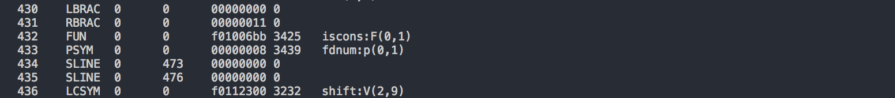

3. run `gcc -pipe -nostdinc -O2 -fno-builtin -I. -MD -Wall -Wno-format -DJOS_KERNEL -gstabs -c -S kern/init.c`

   After running the command, it prints debugging info in stab format into `init.S` located in lab1 folder.

   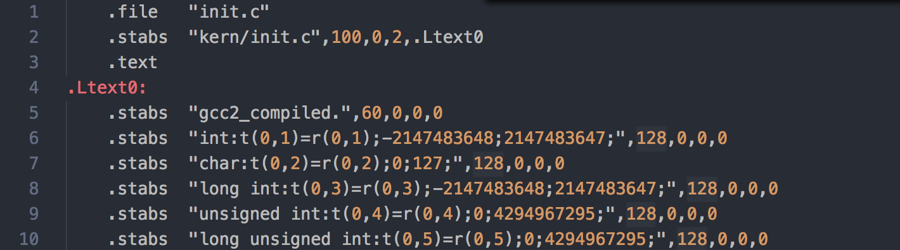

4.  See if the bootloader loads the symbol table in memory as part of loading the kernel binary


The function I realized is shown below. 

```c
	// kern/monitor.c
	// Search within the function definition for the line number.
	// N_SLINE:	text segment line
	stab_binsearch(stabs, &lline, &rline, N_SLINE, addr);
	if (lline <= rline)
	{
		// stabs[lline] points to the line
		// in the string table, but check bounds just in case.
		if (stabs[lline].n_strx < stabstr_end - stabstr)
			info->eip_line = stabs[lline].n_desc;
	}
```


```c
int
mon_backtrace(int argc, char **argv, struct Trapframe *tf)
{
	// Implemented in Exercise 11
	uint32_t arg, apm, temp, ebp, eip, esp;

	cprintf("Stack backtrace:\n");
	//get saved %ebp
	ebp = read_ebp();
	//Exercise 12:	debug info
	struct Eipdebuginfo info;

		while (ebp != 0)
	{
		//Trace back to caller function's %eip
		eip = *((uint32_t *)ebp + 1);
		cprintf(" ebp %x eip %x args ", ebp, eip);
		for(int offset = 2; offset <= 6; offset ++)
		{
			arg = *((uint32_t *)ebp + offset);
			cprintf("%08x ", arg);
		}
		cprintf("\n");

		//Exercise 12: Print debuging info
		debuginfo_eip(eip, &info);

		cprintf("  %s:%u: ", info.eip_file, info.eip_line);
      
		//Exercise 12: print the limit length file name
		for(int i = 0; i < info.eip_fn_namelen;  ++i) {
			cprintf("%c", info.eip_fn_name[i]);
		}
		cprintf("+%d", eip - info.eip_fn_addr);
		cprintf("\n");
      
		//Trace back to caller function's %ebp
		ebp =  *((uint32_t *)ebp);
	}
	return 0;
}
```

